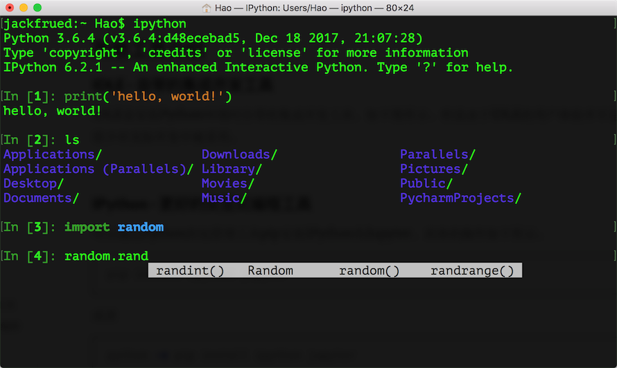

## 初识Python

### Python简介

#### Python的历史

1. 1989年圣诞节：Guido von Rossum开始写Python语言的编译器。
2. 1991年2月：第一个Python编译器（同时也是解释器）诞生，它是用C语言实现的（后面），可以调用C语言的库函数。在最早的版本中，Python已经提供了对“类”，“函数”，“异常处理”等构造块的支持，还有对列表、字典等核心数据类型，同时支持以模块为基础来构造应用程序。
3. 1994年1月：Python 1.0正式发布。
4. 2000年10月16日：Python 2.0发布，增加了完整的[垃圾回收](https://zh.wikipedia.org/wiki/%E5%9E%83%E5%9C%BE%E5%9B%9E%E6%94%B6_(%E8%A8%88%E7%AE%97%E6%A9%9F%E7%A7%91%E5%AD%B8))，提供了对[Unicode](https://zh.wikipedia.org/wiki/Unicode)的支持。与此同时，Python的整个开发过程更加透明，社区对开发进度的影响逐渐扩大，生态圈开始慢慢形成。
5. 2008年12月3日：Python 3.0发布，它并不完全兼容之前的Python代码，不过因为目前还有不少公司在项目和运维中使用Python 2.x版本，所以Python 3.x的很多新特性后来也被移植到Python 2.6/2.7版本中。

目前我们使用的Python 3.7.x的版本是在2018年发布的，Python的版本号分为三段，形如A.B.C。其中A表示大版本号，一般当整体重写，或出现不向后兼容的改变时，增加A；B表示功能更新，出现新功能时增加B；C表示小的改动（例如：修复了某个Bug），只要有修改就增加C。如果对Python的历史感兴趣，可以阅读名为[《Python简史》](http://www.cnblogs.com/vamei/archive/2013/02/06/2892628.html)的博文。

#### Python的优缺点

Python的优点很多，简单的可以总结为以下几点。

1. 简单和明确，做一件事只有一种方法。
2. 学习曲线低，跟其他很多语言相比，Python更容易上手。
3. 开放源代码，拥有强大的社区和生态圈。
4. 解释型语言，天生具有平台可移植性。
5. 对两种主流的编程范式（面向对象编程和函数式编程）都提供了支持。
6. 可扩展性和可嵌入性，例如在Python中可以调用C/C++代码。
7. 代码规范程度高，可读性强，适合有代码洁癖和强迫症的人群。

Python的缺点主要集中在以下几点。

1. 执行效率稍低，因此计算密集型任务可以由C/C++编写。
2. 代码无法加密，但是现在很多公司都不销售卖软件而是销售服务，这个问题会被弱化。
3. 在开发时可以选择的框架太多（如Web框架就有100多个），有选择的地方就有错误。

#### Python的应用领域

目前Python在Web应用开发、云基础设施、DevOps、网络数据采集（爬虫）、数据分析挖掘、机器学习等领域都有着广泛的应用，因此也产生了Web后端开发、数据接口开发、自动化运维、自动化测试、科学计算和可视化、数据分析、量化交易、机器人开发、自然语言处理、图像识别等一系列相关的职位。

### 安装Python解释器

想要开始Python编程之旅，首先得在自己使用的计算机上安装Python解释器环境，下面将以安装官方的Python解释器为例，讲解如何在不同的操作系统上安装Python环境。官方的Python解释器是用C语言实现的，也是使用最为广泛的Python解释器，通常称之为CPython。除此之外，Python解释器还有Java语言实现的Jython、C#语言实现的IronPython以及PyPy、Brython、Pyston等版本，我们暂时不对这些内容进行介绍，有兴趣的读者可以自行了解。
 
 

### 运行Python程序

#### 确认Python的版本

可以Windows的命令行提示符中键入下面的命令。

```Shell
python --version
```
或者是在Linux或macOS系统的终端中键入下面的命令。

```Shell
python3 --version
```

当然也可以先输入python或python3进入交互式环境，再执行以下的代码检查Python的版本。

```Python
import sys

print(sys.version_info)
print(sys.version)
```
 

#### 代码中的注释

注释是编程语言的一个重要组成部分，用于在源代码中解释代码的作用从而增强程序的可读性和可维护性，当然也可以将源代码中不需要参与运行的代码段通过注释来去掉，这一点在调试程序的时候经常用到。注释在随源代码进入预处理器或编译时会被移除，不会在目标代码中保留也不会影响程序的执行结果。

1. 单行注释 - 以#和空格开头的部分
2. 多行注释 - 三个引号开头，三个引号结尾

```Python
"""
第一个Python程序 - hello, world!
向伟大的Dennis M. Ritchie先生致敬

Version: 0.1
Author: 骆昊
"""

print('hello, world!')
# print("你好,世界！")
print('你好', '世界')
print('hello', 'world', sep=', ', end='!')
print('goodbye, world', end='!\n')
```

### Python开发工具

 

#### IPython - 更好的交互式编程工具

IPython是一种基于Python的交互式解释器。相较于原生的Python交互式环境，IPython提供了更为强大的编辑和交互功能。可以通过Python的包管理工具pip安装IPython和Jupyter，具体的操作如下所示。

```Shell
pip install ipython
```

或

```Shell
pip3 install ipython
```

安装成功后，可以通过下面的ipython命令启动IPython，如下图所示。



 

> 说明：事实上[Visual Studio Code](<https://code.visualstudio.com/>)可能是更好的选择，它不用花钱并提供了更为完整和强大的功能，有兴趣的读者可以自行研究。

#### PyCharm - Python开发神器

PyCharm的安装、配置和使用在[《玩转PyCharm》](../玩转PyCharm.md)进行了介绍，有兴趣的读者可以选择阅读。


### 练习

1. 在Python交互式环境中输入下面的代码并查看结果，请尝试将看到的内容翻译成中文。

    ```Python
    import this
    ```

    > 说明：输入上面的代码，在Python的交互式环境中可以看到Tim Peter撰写的[“Python之禅”](../Python之禅.md)，里面讲述的道理不仅仅适用于Python，也适用于其他编程语言。
    >

2. 学习使用turtle在屏幕上绘制图形。

    > 说明：turtle是Python内置的一个非常有趣的模块，特别适合对计算机程序设计进行初体验的小伙伴，它最早是Logo语言的一部分，Logo语言是Wally Feurzig和Seymour Papert在1966发明的编程语言。

    ```Python
    import turtle
    
    turtle.pensize(4)
    turtle.pencolor('red')
    
    turtle.forward(100)
    turtle.right(90)
    turtle.forward(100)
    turtle.right(90)
    turtle.forward(100)
    turtle.right(90)
    turtle.forward(100)
    
    turtle.mainloop()
    ```

    > 提示：本章提供的代码中还有画国旗和画小猪佩奇的代码，有兴趣的读者请自行研究。
